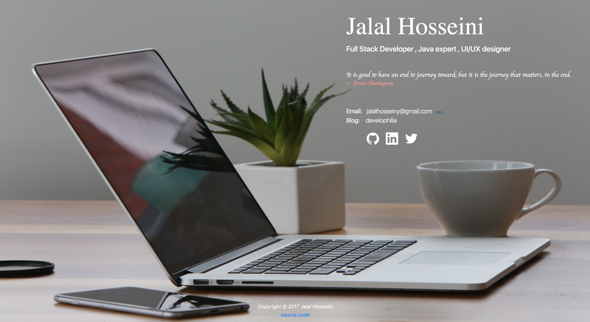

# Personal Webpage

A responsive static single-page personal webpage.

* Based on [webpack-boilerplate](https://github.com/geniuscarrier/webpack-boilerplate) 
* The only dependency is [bootstrap 4](https://getbootstrap.com/) with a few lines of inline javascript. 
* Icons for social media links are from [simple-icons](https://github.com/simple-icons/simple-icons)
* Background photo is from [pexels](https://www.pexels.com)

### Screen shots
Desktop


Mobile


### Install dependencies

```
npm install
```

### Developing locally

1. Run

	```
	npm run dev
	```

2. In your browser, navigate to: [http://localhost:8080/](http://localhost:8080/)

### Publish

1. In `webpack.config.js` file, replace `www.example.com` with the real domain name.

2. Run

	```
	npm run build
	```

3. Copy the following folders/files to web server

	/build,
	/image,
	index.html